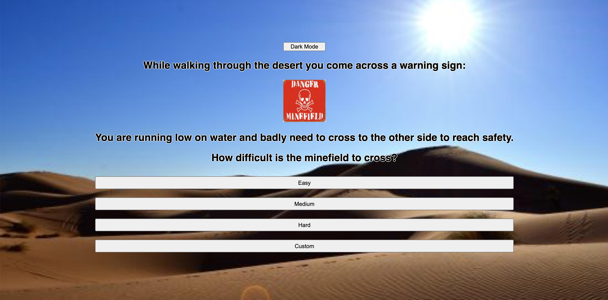
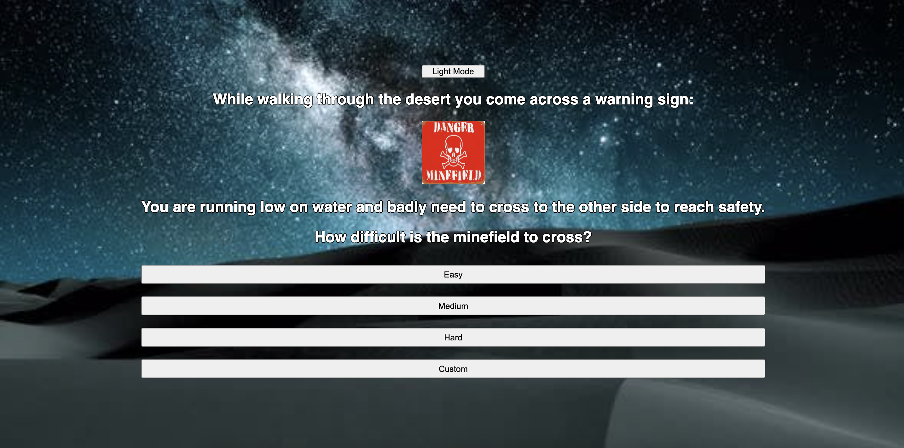
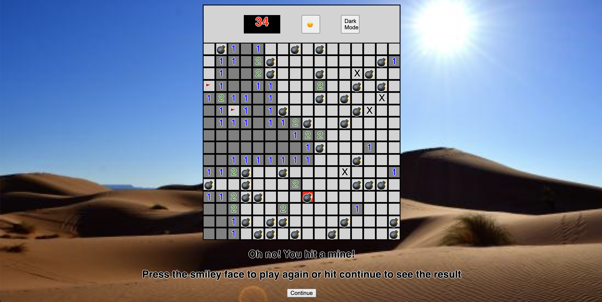
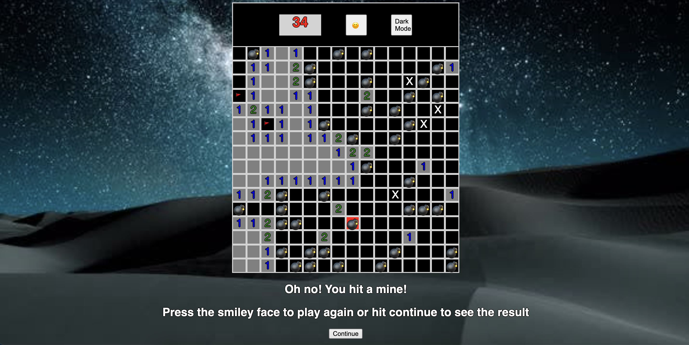
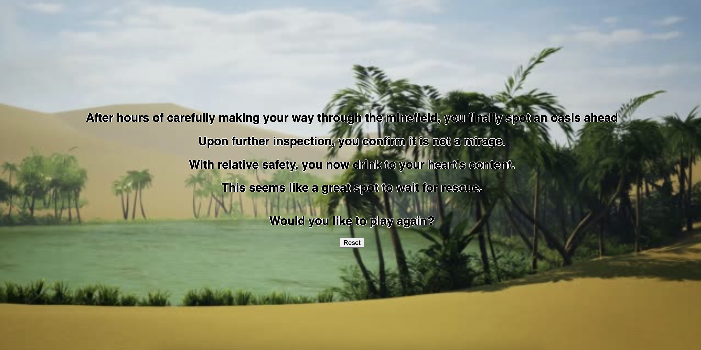
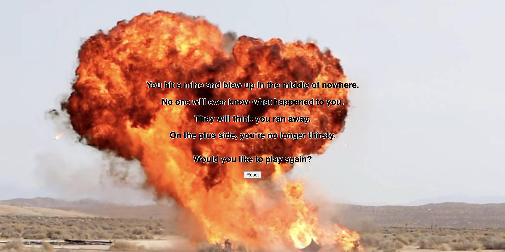
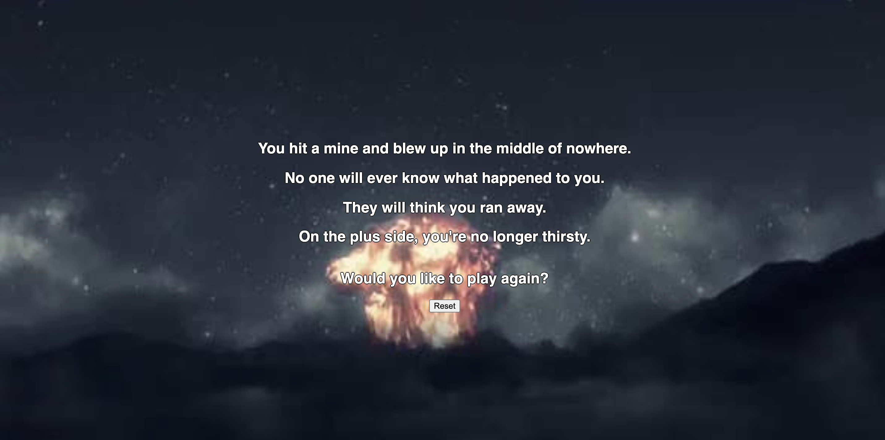

# unit-1-project

<Minesweeper> 
Try to open all the safe spaces on the board. Be careful, if you hit a mine, it's game over.

For a history on mines and their use in war, click here: [explosive-mines](https://en.wikipedia.org/wiki/Explosive_mine)
  

## Getting Started:
#### Play the game here: [https://yoni-minesweeper.netlify.app](https://yoni-minesweeper.netlify.app)
###### How to play: 
Click on any square to start. If you don't hit a mine, a number will appear. This number tells you how many of the 8 connecting squares contain a mine. Use logic to figure out which squares are safe and which to avoid. If you think a square has a mine, right click (or hold down on mobile) to place a flag. This makes sure you don't accidentally trip the mine. If you want to remove the flag, all you have to do is right click again
  
## Screenshots:

  
## Technologies used: 
* Javascript
* HTML
* CSS
* Markup
* Git
  
## Next steps: 
Adding more efficient code, as well as potentially adding sounds and animations
